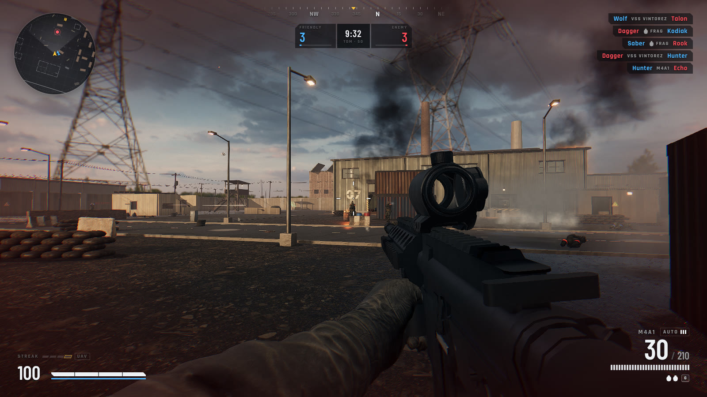
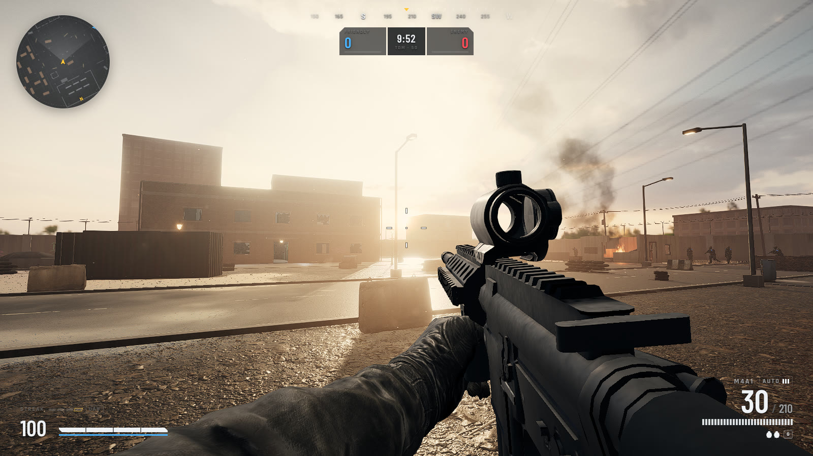
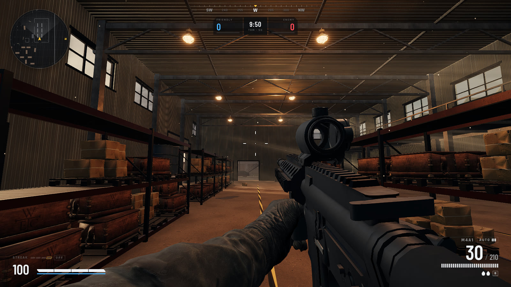
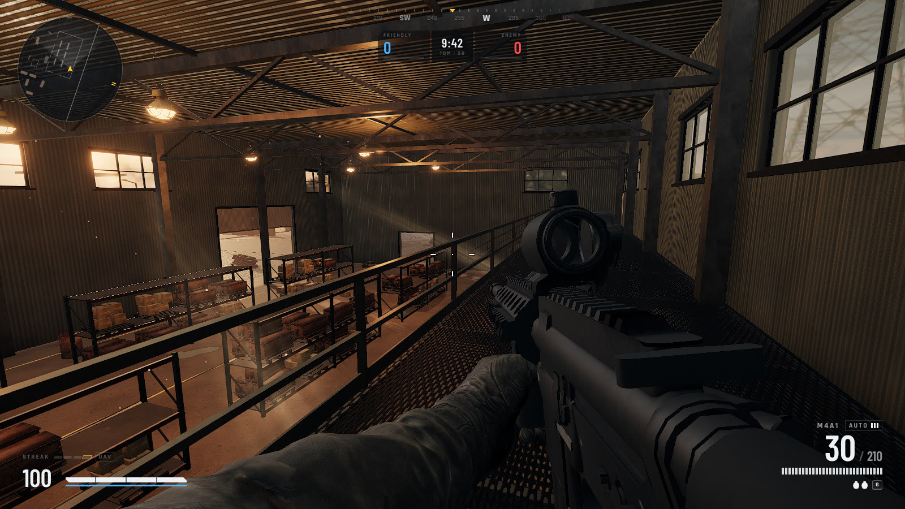
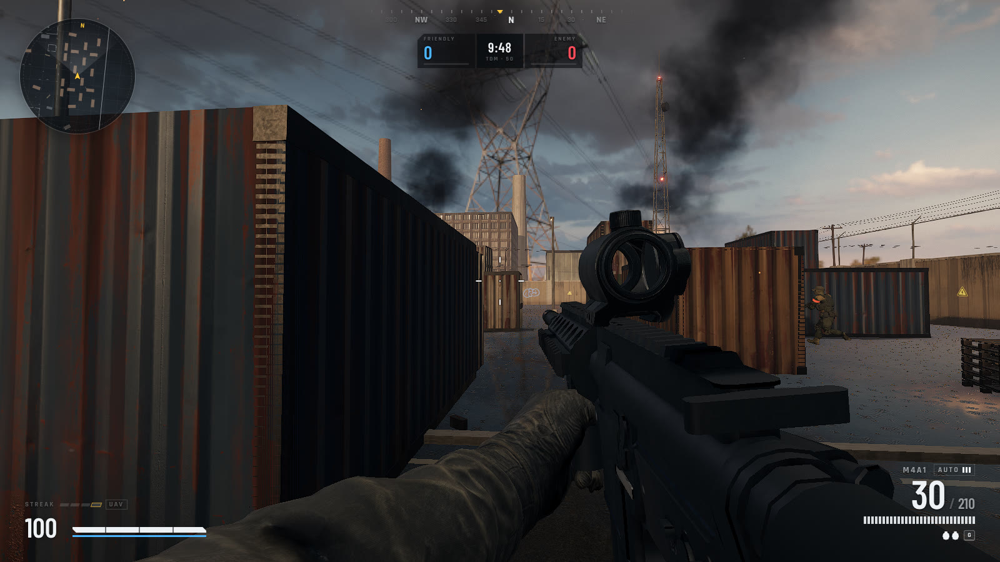

# IRONLINE — realistic browser FPS

A tactical first-person shooter that runs in the browser: **three.js r186** rendering, **Rapier** physics,
**Recast/Detour** navigation for bots, **pmndrs/postprocessing + N8AO** for the image pipeline and an
**AMD FSR 1** upscaler.

```bash
npm install
npm run dev      # http://localhost:5173
npm run build    # static build in dist/
```



| | |
|---|---|
|  |  |
| *Low storm sun, god rays and wet asphalt* | *Warehouse: practical lamps, light shafts, dust* |
|  |  |
| *Catwalk over the racking* | *Container yard after the rain* |

*In-engine captures at 1600x900, High quality (no post-edit).*

## Requirements & performance

- A WebGL2 browser with hardware acceleration on. **Chrome** (or another Chromium browser) is recommended and
  is what the game is tested on.
- First boot picks graphics settings from the GPU (`Renderer.autoQuality`): discrete GPUs get **High + FSR Quality**,
  Apple Silicon and integrated GPUs (Intel Iris/UHD, Radeon APUs) get **Medium + FSR Balanced**, software renderers and
  phones get **Low + FSR Performance**. On Apple GPUs the automatic setting also turns off the viewmodel light probe
  (a GPU→CPU readback) and the viewmodel shadow pass, which stall Metal's tile-based GPUs. Picking a quality or
  upscaling mode yourself turns this off.
- **Adaptive quality**: while the quality is still automatic, a machine that averages under 30 fps steps one feature
  down at a time (AO → god rays → shadow map → viewmodel probe → bloom → render scale) and shows a toast. It never steps
  back up by itself; picking a quality in Settings resets it.
- **Graphics benchmark**: Settings → Video → *Run graphics benchmark*. It replays a fixed 5-view camera tour once per
  step, turning one feature off per step, and reports frame ms (mean / p95), main-thread ms, GPU ms per pass (where
  `EXT_disjoint_timer_query_webgl2` exists), draw calls and shader programs. *Copy results* gives a plain-text table
  for bug reports.
- Budgets and measurements: [`docs/PERF.md`](docs/PERF.md).

## Features

- **Map**: *Ironline Depot*, an abandoned industrial compound at the edge of a live war zone: warehouse with catwalks
  and racks, two-storey office, container yard, western ruins and guard tower, central courtyard. Stormy golden hour
  after rain, with distant artillery, flares, smoke columns, burning wrecks, drizzle, lightning and helicopter
  fly-bys.
- **Movement** (Source-style accel/friction): walk, sprint, **tactical sprint** (double-tap Shift, limited stamina),
  crouch, **slide** (crouch while sprinting), jump, **vault** over low cover, **mantle** onto ledges (also from the
  air), lean Q/E, slow walk (Alt, silent), fall damage. **Full-body awareness**: your own legs and shadow
  (`PlayerBody.js`).
- **Camera feel**: eased recoil kick, trauma-based shake, head bob from mocap-derived curves (`CamCurves.js`), landing
  dip, lean/slide roll, sprint FOV, ADS zoom with zoom-relative sensitivity. *Reduce camera motion* scales it down.
- **Weapons (11)**: M4A1 and AK-47 (assault rifles), SCAR-L (battle rifle), MP5A5 (SMG), VSS Vintorez (marksman SMG),
  RPK-74 (LMG, drum), M870 MCS (pump shotgun), M24 SWS and AWM .338 (bolt-action), P226 and M1911A1 (pistols).
  Fire modes auto / burst / semi / pump / bolt (per weapon), sprint-to-fire delay, **tactical vs empty reloads**
  (+1 in the chamber, reload cancel before the commit point), shell-by-shell shotgun loading, bolt cycling, inspect,
  melee (backstabs kill), cookable frag grenades.
- **Recoil** (`Recoil.js`, research in [`docs/RECOIL_RESEARCH.md`](docs/RECOIL_RESEARCH.md)): per-weapon climb and
  drift profiles that move your real aim; nothing returns during a string, so you pull down. A single tap settles back
  to the point of aim, longer strings only partly. Spread bloom, stance and movement modifiers, bipod bracing.
  Bots use the same recoil and control it according to difficulty.
- **Gunsmith** (menu, or T while dead): optics (iron sights, red dot, holographic, 3.5x picture-in-picture combat
  scope, 8x sniper scope with 4x/8x zoom, glint and hold-breath), muzzle (suppressor, compensator, flash hider, brake),
  long/short barrel, vertical/angled grip, bipod, extended/fast mags, tac laser, all with live stat bars and TTK.
- **First-person presentation**: per-weapon rigs (gloved arms skinned to each gun, built offline in Blender, see
  [`docs/FP_FRAMING.md`](docs/FP_FRAMING.md)) with an authored rifle animation set (idle, walk, sprint carry, fire,
  reload, equip), hand-authored reload choreography (`ReloadChoreo.js`) with the magazine in the support hand, IK for
  the support arm, pistol slide/flip springs, inspect animations.
- **Ballistics**: projectile bullets with drop and travel time, damage falloff, headshot/limb multipliers, wall
  penetration through wood / plaster / thin metal, tracers, near-miss whiz and suppression.
- **Effects**: muzzle flashes with dynamic light, surface-specific impacts (sparks, dust, chips, blood), bullet-hole
  decals with normal maps, physical brass, explosions and smoke (Unity Labs flipbooks).
- **Bots**: perception (vision cone + LOS + hearing), memory, utility-scored goals (patrol, engage, investigate,
  cover, reload, grenade), difficulty-based aim (reaction time, tightening aim error, recoil control), strafing,
  navmesh pathing with crowd avoidance. Animated soldiers with layered upper/lower-body animation, mocap
  locomotion with foot locking, aim IK and procedural deaths. Four difficulties, 1–8 bots per team.
- **Modes**: Team Deathmatch (first to 50) and Free-For-All (first to 25), 10-minute limit, line-of-sight-aware
  spawns, kill feed, score tally, medals, UAV killstreak at 4, scoreboard, XP and levels, end-of-match summary.
- **HUD**: ammo / fire mode, health bar with streak pips, stamina, compass with pings, rotating minimap (UAV reveals
  enemies), dynamic crosshair (colour selectable), hitmarkers, damage direction arcs, grenade cook timer, scope overlay
  with breath bar, death card with killer health and killer cam, optional FPS counter (shows internal render scale).
- **Graphics**: four quality presets (Low / Medium / High / Ultra), **FSR 1 upscaling** (EASU + RCAS; Quality /
  Balanced / Performance / Dynamic), **CAS sharpening** when upscaling is off, **dynamic resolution**, adaptive quality,
  built-in benchmark, N8AO, god rays, bloom, lens dirt, ACES + colour grade, SMAA, height fog, wet-surface puddles.
  Performance work: precomputed visibility (**PVS**, `Pvs.js`), cached static sun shadows (`ShadowCache.js`), point-light
  pool (`LightPool.js`), bot occlusion culling (`Occlusion.js`), runtime mesh LODs with an IndexedDB cache (`Lod.js`),
  baked navmesh, per-pass GPU timers (`GpuTimer.js`).

## Controls

Defaults (`src/core/Input.js`; also listed in the in-game *Controls* page).

| Key | Action |
| --- | --- |
| W A S D / Mouse | Move / look |
| LMB / RMB | Fire / aim down sights (hold; *Toggle ADS* in Settings) |
| Middle mouse | Switch 4x / 8x on the sniper scope |
| Shift | Sprint · double-tap: tactical sprint · hold while scoped: hold breath |
| Space | Jump · vault · mantle |
| C / Ctrl | Crouch (toggle; *Hold to crouch* in Settings) · while sprinting: slide |
| Alt | Slow walk (silent) |
| Q / E | Lean left / right |
| R | Reload |
| B | Cycle fire mode |
| 1 / 2 / mouse wheel | Primary / secondary |
| V | Melee |
| G | Frag grenade (hold to cook, release to throw) |
| I | Inspect weapon |
| L | Toggle laser (with the Tac Laser fitted) |
| Tab | Scoreboard (hold) |
| Esc | Pause menu |
| T | Gunsmith (while dead) |

## Settings

- **Mouse**: sensitivity, ADS sensitivity multiplier, invert Y, toggle ADS, hold to crouch.
- **Video**: field of view (70–120, default 100), viewmodel FOV, quality (Low / Medium / High / Ultra), upscaling
  (Off / FSR Quality / Balanced / Performance / Dynamic), sharpness (RCAS with FSR, CAS without), render-resolution
  readout, render scale (upscaling off), show FPS, dynamic resolution, adaptive quality, reduce camera motion,
  graphics benchmark, crosshair colour.
- **Audio**: master volume.
- **Match**: bot difficulty (Recruit / Regular / Hardened / Veteran), bots per team (1–8), practice mode
  (invulnerable).

Settings, loadout and career XP are stored in `localStorage` (`ironline.settings`).

## Code map

```
src/main.js             boot, main loop, pointer lock
src/core/               Input, Physics (Rapier wrapper, hang forensics, step-skip), Audio (WebAudio + synth),
                        Assets (GLTF/meshopt/HDR loading), MathUtil (springs, damping)
src/render/             Renderer (presets, post stack, dynamic res), Fsr (FSR 1 EASU + RCAS), Effects (particles,
                        tracers, decals, brass), ProcTex (procedural textures), Perf (window.__perf instrumentation),
                        Benchmark, Adaptive (adaptive quality), GpuTimer, UploadRing (opt-in Apple/Metal mitigation),
                        Pvs, ShadowCache, Lod, LightPool, Occlusion (bot occlusion culling)
src/world/              Level (Ironline Depot), LevelEnv (HDRI, IBL, height fog, light shafts, dust),
                        Materials (PBR library + shared "unify" pass), Geo (world-UV boxes), Ambience +
                        ambience/ (DistantBattle, Fires, Weather, Flyover, AmbAudio, AmbParticles, flame, glsl)
src/game/               Game (loop, firing, grenades), Player (movement controller), PlayerBody (full-body
                        awareness), FPCamera, CamCurves (baked camera motion), Ballistics, Match (modes, spawns, medals)
src/game/weapons/       WeaponDefs (weapons + attachments + stats), Weapon (state machine), Recoil (aim recoil),
                        GunModels (model loading), ViewModel (first-person presentation), FPRig (rig + arm IK),
                        FPAnims (authored rifle animation set), ReloadChoreo (reload choreography)
src/game/bots/          Bot (AI), Character (third-person animation, IK, LOD), Navigation (Recast + Detour crowd)
src/ui/                 HUD, Menu (pages, settings, gunsmith, end screen), hud.css
public/assets/          models, textures, audio, HDRI, anims, baked nav/ and pvs/
tools/                  QA runner, bakes, Blender rig pipeline, audio/mocap prep (see tools/README.md)
docs/                   design specs, research and reports (see below)
```

Docs: [`QUALITY_BAR`](docs/QUALITY_BAR.md) (principles and art direction), [`ART_PIPELINE`](docs/ART_PIPELINE.md)
(how assets are made to match), [`PERF`](docs/PERF.md), [`FP_FRAMING`](docs/FP_FRAMING.md) (first-person rig
contract), [`QA_REPORT`](docs/QA_REPORT.md), [`RECOIL_RESEARCH`](docs/RECOIL_RESEARCH.md),
[`REFERENCE_ENEMIES`](docs/REFERENCE_ENEMIES.md) (bot pose spec), [`ANIMATION_RESEARCH`](docs/ANIMATION_RESEARCH.md)
and [`ASSET_SOURCES`](docs/ASSET_SOURCES.md) (historical research).

## Credits & licences

Code is original except where noted:

- **AMD FidelityFX Super Resolution 1.0** (EASU upscaling + RCAS sharpening): GLSL port of `ffx_fsr1.h` from
  [GPUOpen-Effects/FidelityFX-FSR](https://github.com/GPUOpen-Effects/FidelityFX-FSR), Copyright (c) 2021 Advanced
  Micro Devices, Inc. — MIT licence (`src/render/Fsr.js`). The CAS sharpen used with upscaling off follows AMD
  FidelityFX CAS (MIT).
- Libraries (npm, their own licences): three.js, Rapier, recast-navigation-js, postprocessing, N8AO, meshoptimizer
  (via three), Fontsource fonts.
- Design references: Mugen87/dive & Yuka (bot architecture), Quake/Source movement, CS/Valorant/Insurgency/Tarkov
  recoil design, F.E.A.R. & Killzone bot AI talks.

Third-party assets shipped in `public/assets/`. CC BY items are credited here as the licence requires;
"modified" means re-posed, re-rigged, rescaled, simplified, maker markings removed and/or textures re-encoded (WebP).

**First-person weapons** (`models/fp/*.glb`, built by `tools/blender/`; CC BY 4.0 unless noted; modified, AO baked):

- Gloved arms: "Fps arms" by bumstrum (DJMaesen) — https://sketchfab.com/3d-models/fps-arms-9452ce4cddde4110a4fd73e555a8e412
- Arm rig and grip templates by ccransh: "FPS AK-74m animations"
  (https://sketchfab.com/3d-models/fps-ak-74m-animations-94be8385c402474cacd39bc096c6ca14), "FPS pistol animations"
  (https://sketchfab.com/3d-models/fps-pistol-animations-0d7a343dcb6f401197a73c91aee93f6d), "FPS animations sniper
  rifle" (https://sketchfab.com/3d-models/fps-animations-sniper-rifle-c15ae8393d824f5b929e3f69691cdd31).
- Remington 870: "FPS Arms remington (shotgun)" by ccransh, 870 by tris09 —
  https://sketchfab.com/3d-models/fps-arms-remington-shotgun-e68ef617fe8a48cca8610d016ffd5881
- M4A1: "M4A1" by Firewarden — https://sketchfab.com/3d-models/m4a1-40d8ef818c7549a896371cbb1f64fec6
- SCAR-L: "FN Scar-L Assault Rifle" by Hitansh_3DArtist — https://sketchfab.com/3d-models/fn-scar-l-assault-rifle-ea1823de59684fd596d9f6726382f948
- MP5A5: "MP5 Submachine Gun" by Rotuma — https://sketchfab.com/3d-models/mp5-submachine-gun-a73b61932a0e4eecb5db5c63c158aa24
- VSS: "Special Sniper Rifle VSS Vintorez" by ArmsMuseum — **CC0** — https://sketchfab.com/3d-models/special-sniper-rifle-vss-vintorez-4d5d8c1b7b79429abfa4816f18330089
- M24: "M24 Bounty Hunter Sniper Rifle" by Naudaff3D — https://sketchfab.com/3d-models/m24-bounty-hunter-sniper-rifle-d40e74e2259549f5b025807163f1028c
- AWM: "AWM" by erhanmatur — https://sketchfab.com/3d-models/awm-bacc05ad5c074c9daa3aa7ca02766a6c
- P226: "Sig Sauer P226" by Alexcanot — https://sketchfab.com/3d-models/sig-sauer-p226-e3d4f1ab22f342f4a0891743353c114c
- M1911: "M1911 pistol" by egorbelous — https://sketchfab.com/3d-models/m1911-pistol-80a0b8a6c4314da4a7b3a7cfe6cec1d4
- AK-47 / RPK-74: the Operation Steel Tide AK mesh (below), re-rigged.
- Rifle animation set (`anims/fp_rifle_anims.json`): motion retargeted from the **Free FPS Template** Blender source
  files (Fab), used under the Fab licence (controller shapes by Helindu). Only effector motion is shipped; no template
  mesh is.

**Optics** (`models/weapons/optics.glb`; CC BY 4.0; logos and markings removed, housings smoothed):

- Red dot: "Generic Red Dot Scope / Rifle Attachment Lowpoly" by valterjherson1 — https://sketchfab.com/3d-models/generic-red-dot-scope-rifle-attachment-lowpoly-8bf2794c30d04fa0aed1e3df92cd8a9e
- Holographic: "EoTech EXPS3-0 Holographic Weapon Sight Lowpoly" by valterjherson1 — https://sketchfab.com/3d-models/eotech-exps3-0-holographic-weapon-sight-lowpoly-45e4fcdfb1b34756ab9e866564a12f66
- 3.5x scope: "Advanced Combat Optical Gunsight | Game Ready" by Argentavisss — https://sketchfab.com/3d-models/advanced-combat-optical-gunsight-game-ready-4675fc83ccc54c018d4d03ee1709e8f5
- Sniper scope: "Nightforce ATACR 4-20x50 F1 Riflescope" by ense7en — https://sketchfab.com/3d-models/nightforce-atacr-4-20x50-f1-riflescope-2ae2ddbc7ee049e3afcc3117f4ce6aa5

**Fallback weapon set** (`models/weapons/*.glb` other than `optics.glb`; the guns load only for weapons without an FP
rig, the legacy arms still load at boot):

- Weapon meshes, arm-pose / reload-timing data and the AK used by the AK/RPK rigs:
  [AetherRadar/operation-steel-tide](https://github.com/AetherRadar/operation-steel-tide) — MIT for project work;
  underlying meshes CC0 (nisu, taradavies, Quaternius "Ultimate Guns").
- SCAR-L: "ScarL" by AdamKokrito — CC BY 3.0 (https://poly.pizza/m/ab1V8RlPDc), adapted by Operation Steel Tide.
- Legacy arms & reload animations (`smg45_*_arms.glb`, `animated_reload_arms.glb`): "fps animated smg" by DJMaesen —
  CC BY 4.0 (https://sketchfab.com/3d-models/fps-animated-smg-ea3dad7478624495a5a46f40127b0579), adapted by Operation
  Steel Tide.
- Shotgun: by Harry_L — CC BY (https://sketchfab.com/models/53b158b0d5a54b4491b09d1fb3058e29), via Mugen87/dive.

**Characters** (`models/characters/`):

- Bot body (`soldier_tac.glb`): "Military tactical suit (LowPolyGameReady)" by DanlyVostok (1799danly) — CC BY 4.0
  (https://sketchfab.com/3d-models/military-tactical-suit-lowpolygameready-ef698ce36b1545a78ce592dd3db4c7ed); meshes
  merged, textures WebP.
- Rig, clips and fallback body (`soldier.glb`): "FREE [Military Soldier] RIGGED" by BAMEN — CC BY 4.0
  (https://sketchfab.com/3d-models/free-military-soldier-rigged-e9c56308a67d4a3db62e914fafa4d198).
- Animation clips: Quaternius **Universal Animation Library** 1 & 2 (Standard) — CC0 (https://quaternius.com),
  retargeted. UAL2 head motion is also baked into the camera curves (`CamCurves.js`).
- Bot locomotion mocap: walk/jog/crouch cycles (Swat and Crouched styles) from the **100STYLE** dataset by Ian Mason,
  Sebastian Starke and Taku Komura — CC BY 4.0 (https://zenodo.org/records/8127870); cycles extracted, loop-closed and
  retargeted (`mocap_*` clips in `soldier.glb`, built by `tools/bots_mocap/`).

**World**:

- HDRI: Poly Haven "Bambanani Sunset" (Dimitrios Savva, Jarod Guest) — CC0 (`hdr/bambanani_sunset_2k.hdr`).
- Props (`models/props/`): Poly Haven — CC0: old_military_crate, concrete_road_barrier(_02), Barrel_01/02, barrel_03,
  ammo_box, cardboard_box_01, old_tyre, exterior_aircon_unit, street_lamp_01, security_light, utility_box_01/02,
  metal_trash_can, water_manhole_cover, covered_car, trashbag, metal_jerrycan_green, propane_tank, portable_generator,
  hanging_industrial_lamp, mounted_fluorescent_lights, modular_industrial_pipes_01, wooden_crate_02, cement_bag,
  rusted_wheel_rim_01, WetFloorSign_01, barrel_stove (simplified, WebP via gltf-transform). Also shipped but not
  currently placed: rollershutter_door, street_lamp_02.
- Surface textures (`textures/`), all CC0, re-encoded to WebP (AO baked into colour where present):
  ambientCG (https://ambientcg.com) Asphalt031, Bricks097, Concrete034, Concrete047A, Concrete048, Fabric083,
  Facade018A, Facade020A, Fence006, Ground110, Leaking003, Metal046B, Metal055A, Metal063, MetalWalkway013,
  OfficeCeiling006, PaintedPlaster015, PavingStones138, Plaster003, Tiles139, Wood051, Wood092; Poly Haven
  (https://polyhaven.com) concrete_floor, corrugated_iron, rusty_painted_metal, weathered_planks (`WeatheredPlanks`),
  rusty_corrugated_iron (`RustyCorrugated`). Some sets came via Tiddybub/3d-assets and operation-steel-tide.
- Decal atlas (`textures/DecalAtlas`): ambientCG GraffitiSet001, Leaking012A, Leaking014A, Leaking016A, Leaking019B,
  Sign004, Sign009, Sign021, Tape001, TireTracks001, AsphaltDamage001 (CC0; cropped, alpha derived/aged), plus
  procedurally generated oil-stain, scorch, crack and stencil cells made for this project.
- Ambience (`ambience/`): "Destroyed Ford Crown Vic" by alexdelker
  (https://sketchfab.com/3d-models/destroyed-ford-crown-vic-1506140c97654d759cc4c60c20d1d2a8) and "Sikorsky UH-60 Black
  Hawk" by helijah (https://sketchfab.com/3d-models/sikorsky-uh-60-black-hawk-ee81eb66006b4d8980d0cf9ff6304b69) —
  CC BY 4.0, simplified/re-lit (see `public/assets/ambience/models/*/SOURCE.md`); Unity Labs VFX flipbooks Explosion01,
  WispySmoke02, Flame03 — CC0; Poly Haven rusty_metal_04 — CC0.

**Audio** (`audio/`):

- Gunshots & firearm foley: The Free Firearm Sound Library — CC0
  (https://github.com/buddingmonkey/FreeFirearmsSFXLibrary), plus edits from operation-steel-tide.
- Footsteps, impacts, UI, explosions: Kenney Impact Sounds, Interface Sounds and Sci-Fi Sounds — CC0 (https://kenney.nl).

**Fonts**: Rajdhani, Barlow Condensed — SIL OFL, via Fontsource.

**Source archives in the repo root** (inputs to the offline pipelines, not loaded by the game):

- `Universal Animation Library[Standard].zip`, `Universal Animation Library 2[Standard].zip` — Quaternius, CC0.
- `Blender_Source_Files_FreeFpsTemplate 2.zip` — Free FPS Template (Fab), used under its Fab licence; source of the
  rifle animation set. It also contains the UE5 "Manny" mannequin and the "Low-Poly AAC Honey Badger" by TastyTony
  (CC BY 4.0); neither mesh is shipped in the game.
